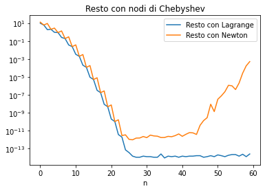
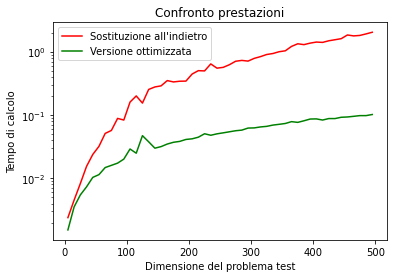

# Numerical Methods in Python

A comprehensive collection of numerical methods implemented in Python, designed for solving complex mathematical problems efficiently and accurately. This project showcases various algorithms and techniques essential in scientific computing, engineering, and data analysis.

## 🚀 Features

- Linear Algebra Operations: LU factorization, forward and backward substitution
- Interpolation Techniques: Lagrange polynomials, Newton's divided differences
- Root-Finding Methods: Newton-Raphson, Secant, Chord method
- Numerical Integration: Trapezoidal rule, Simpson's rule
- Iterative Methods: Jacobi and Gauss-Seidel for solving linear systems
- Condition Number Analysis: For functions and matrix operations
- Performance Comparisons: Benchmark different methods for various problem sizes

## 📊 Visualizations

This project includes numerous visualizations to help understand the behavior and performance of different numerical methods:

- Convergence rates of integration methods
- Error analysis for interpolation techniques
- Performance comparisons of linear algebra operations
- Condition number visualizations for different functions



*Comparison of interpolation methods using equidistant nodes vs Chebyshev nodes*

## 🛠️ Installation

1. Clone the repository:
```
git clone https://github.com/katyatrufanova/numerical-methods-python.git
cd numerical-methods-python
```

2. Create a virtual environment (optional but recommended):
```
python -m venv venv
source venv/bin/activate  # On Windows, use `venv\Scripts\activate`
```

3. Install the required packages:
```
pip install -r requirements.txt
```

## 📈 Performance

This project includes performance analysis for various methods. For example, the comparison between optimized and non-optimized versions of backward substitution:

